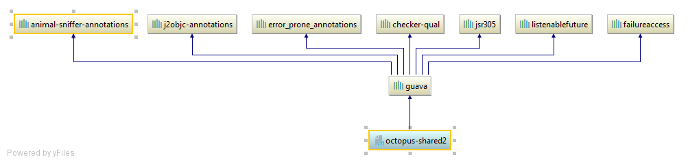

## Maven structure for Integration components

### Common information

* This structure collapses the chain of POM inheritance. It reduces the risk that developers insert something unexpected to the middle of hierarchy.
* It also separate the different aspects. 
  - The libs and plugins versions are specified in parent pom (one place); 
  - The "bulk build poms" contain no information about how to build and which plugins to use;
  - Dependencies come from another dependencies, not from the parent pom (but it is possible in some cases);
  
### Let's see closer
At first, make a statement that we have 2 types of artifacts: libraries (shared components) and running jars (VM). VMs is a final level of hierarchy, so no others components can depends on it.  

From the directories perspective this structure copies the current integration codebase structure. But few changes are made:

* The very top parent pom contains versions of dependencies (internal and external), it also contain the common variables, and common plugins. (See *octopus-parent*) 
i.e. the things that are essential for all artifacts. All artifacts poms should inherit this parent pom. It also has it's own release cycle. It is placed in separate folder and basically is a "component without code";
In some cases the additional poms can be build into hierarchy, see *octopus-ti-parent*.
* The second type of non-artifact pom is a "bulk build poms". They are placed in directories and their function is processing cascade build.

##### Few samples:
We have 3 shared components, *octopus-shared1* and *octopus-shared2* has dependency to apache-common:


and guava:

          

The version of dependencies is controlled from parent pom *octopus-parent*.

We also have 3 ti components, but they don't inherit *octopus-parent*, they have own parent *octopus-ti-parent*, which in its turn, inherits *octopus-parent*:


As you can see it has dependency to logging, lombok and to *octopus-shared1*. Normally, all ti components inherit this dependencies, but some of them has own:

ti1:


(the dependency to *octopus-ti-parent* is not shown here cause it is parent, but dependencies which come via *octopus-ti-parent* is shown)

ti2:


(the dependency to *octopus-ti-parent* is not shown here casue it is parent, but dependencies which come via *octopus-ti-parent* is shown)

##### Few scenarios.
######Case 1
Let's consider, that developer John works on *shared1* component. He commits code, but his changes are not visible for others components until he release shared1.
Once the job is done he runs ```mvn release:prepare release:perform -B``` (or job in Bamboo, if it exists) and if in  *octopus-parent* is specified:
```xml
<dependency>
    <groupId>de.octopus-project</groupId>
    <artifactId>octopus-shared1</artifactId>
    <version>RELEASE</version>
</dependency>
```
the ti components will use the latest *released* shared1. But if component is critical, the distinct version can be specified in *octopus-parent*:  
```xml
<dependency>
    <groupId>de.octopus-project</groupId>
    <artifactId>octopus-shared1</artifactId>
    <version>0.0.3</version>
</dependency>
```
In this case, the *octopus-parent* must be amended and released. For avoid changing the <parent> section in all components I prefer to have RELEASE version:   
```xml
<?xml version="1.0" encoding="UTF-8"?>
<project xmlns="http://maven.apache.org/POM/4.0.0" xmlns:xsi="http://www.w3.org/2001/XMLSchema-instance" xsi:schemaLocation="http://maven.apache.org/POM/4.0.0 http://maven.apache.org/xsd/maven-4.0.0.xsd">

    <modelVersion>4.0.0</modelVersion>
    <artifactId>octopus-shared3</artifactId>
    <version>0.0.1-SNAPSHOT</version>
    <packaging>jar</packaging>
    <name>octopus-shared3</name>

    <parent>
        <groupId>de.octopus-project</groupId>
        <artifactId>octopus-parent</artifactId>
        <version>RELEASE</version>
    </parent>
</project>
```
But it is discussable.

######Case 2
The *octopus-ti2* must be emergency fixed. For fixing the *octopus-shared1* and *octopus-shared2* must be changed.
The  *octopus-shared1*,  *octopus-shared2* and *octopus-ti2*  are released with PATCH version incrementing (https://semver.org/), in *octopus-ti2* POM the new version of *octopus-shared1* and *octopus-shared2* are specified, but the  
*octopus-parent* is not changed. So, the patch of *octopus-shared1*, *octopus-shared2* is not visible for others ti. During the next release, the minor version is incremented for all components and all versions are aligned. The patch version in *octopus-ti2* POM is removed.

     
#### Advantages. (at lease as I can see it :)

1. The artifacts versions are in one place;
2. The inheritance levels are decreased;
3. The dependencies well organized but in same time flexible;
4. Makes easier to open part of codebase and work with it separately and be sure that up-to-date changes are available;
5. Makes easier in the future organising the separate build/release pipelines for each component in Bamboo.
6. Plugins management are centralized (im my case all ti are build with *spring-boot-maven-plugin* but absolutely all component are build with *maven-source-plugin* and *maven-javadoc-plugin*) 
 
#### Disadvantages. 
1. Need to keep parent poms like a separate components;
2. Need to release components and parent poms for propagating the changes among others components;   
3. The components have different PATCH versions during deployment, but it will be aligned during big release rolling out; 


Thanks!


